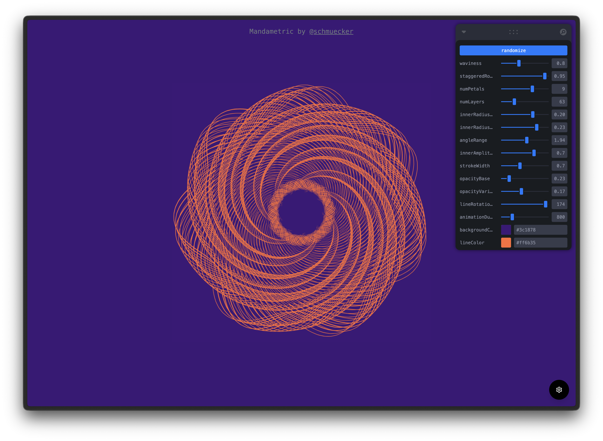

# 💫 Mandametric

A parametric logo generator that creates beautiful SVG visuals with real-time customization controls.



## Features

- **Parametric Design**: Generate complex logos using mathematical parameters (probably not your next company logo)
- **Real-time Controls**: Interactive parameter adjustment with immediate visual feedback
- **Smooth Animations**: (Almost) fluid transitions between different logo configurations
- **Export Options**: Save your creations as SVG or PNG files (PNG doesn't work)
- **Configuration Management**: Save and load custom parameter sets
- **Responsive Design**: Scales beautifully across different screen sizes (could be better, could be worse)
- **Zoom Controls**: Mouse wheel zoom for detailed logo inspection

## Parameters

Customize your logo with these parameters:

- **Waviness**: Controls the curvature variation of the logo elements
- **Staggered Rotation**: Adds rotational offset between layers
- **Number of Petals**: Defines the symmetry of the logo
- **Number of Layers**: Controls the complexity and depth
- **Inner Radius Range**: Sets the minimum and maximum inner circle sizes
- **Angle Range**: Determines the arc span of each petal
- **Inner Amplitude**: Controls the modulation of inner elements
- **Stroke Width**: Adjusts the thickness of the logo lines
- **Opacity Settings**: Fine-tune transparency and variation
- **Line Rotation Spread**: Adds rotational variation to individual lines
- **Animation Duration**: Controls transition smoothness
- **Colors**: Customize background and line colors

## Getting Started

### Prerequisites

- bun

### Installation

1. Clone the repository:
```bash
git clone https://github.com/schmuecker/mandametric.git
cd mandametric
```

2. Install dependencies:
```bash
bun install
```

3. Start the development server:
```bash
bun run dev
```

4. Open [http://localhost:5173](http://localhost:5173) in your browser.

### Build for Production

```bash
bun run build
```

## Usage

1. **Customize**: Use the Leva control panel (bottom-right) to adjust parameters
2. **Randomize**: Click the "Randomize" button for instant new designs
3. **Save Config**: Save your favorite parameter combinations to local storage
4. **Load Config**: Reload previously saved configurations
5. **Export**: Download your logo as SVG (vector) or PNG (todo: fix)
6. **Zoom**: Use mouse wheel to zoom in/out for detailed viewing

## Tech Stack

- **Frontend**: React 18 with TypeScript
- **Build Tool**: Vite
- **UI Components**: shadcn/ui with Radix UI primitives
- **Styling**: Tailwind CSS
- **Controls**: Leva (Tweakpane)
- **Animations**: React Spring

## Project Structure

```
src/
├── components/
│   ├── ui/           # shadcn/ui components
│   ├── ParametricLogo.tsx  # Main logo component
│   ├── ConfigDrawer.tsx    # Configuration panel
│   └── CleanSVGLogo.tsx    # Alternative logo component
├── pages/
│   ├── Index.tsx     # Main application page
│   └── NotFound.tsx  # 404 page
├── hooks/            # Custom React hooks
├── lib/              # Utility functions
└── main.tsx          # Application entry point
```

## Contributing

Contributions are welcome! Please feel free to submit a Pull Request.

## License

This project is open source and available under the MIT License.

## Author

Created by [@schmuecker](https://github.com/schmuecker)
